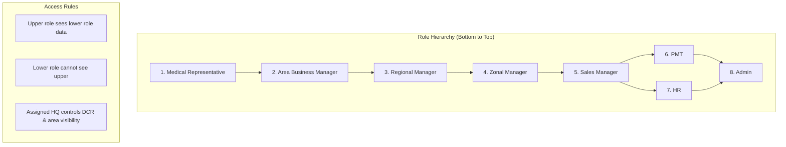
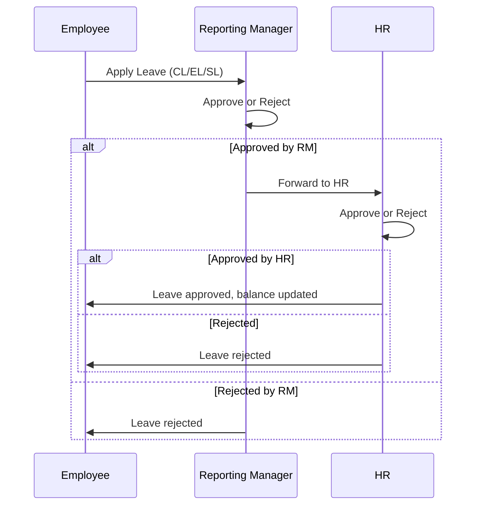
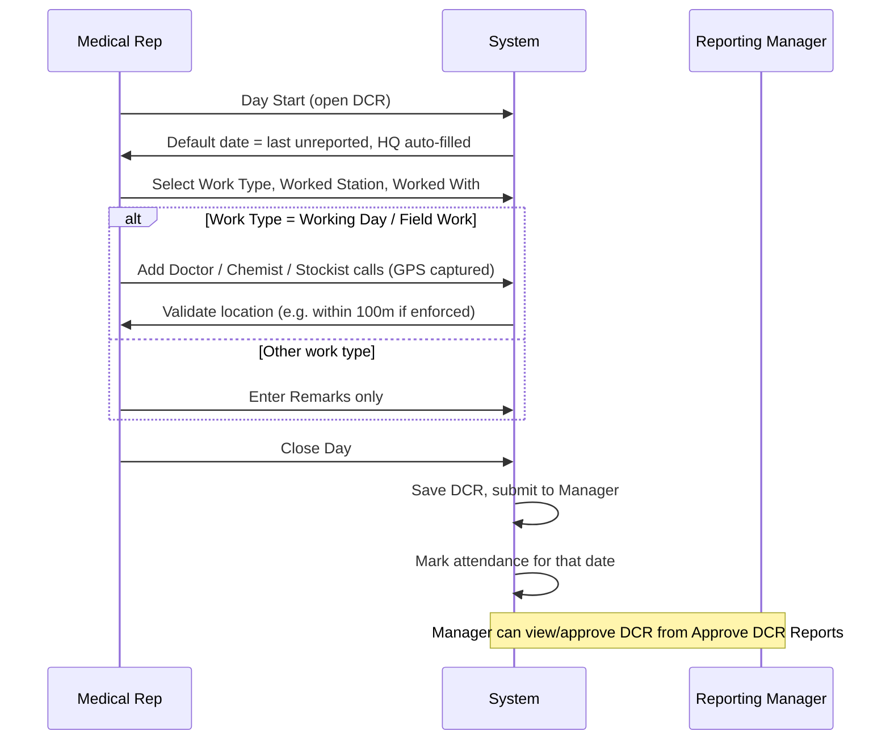
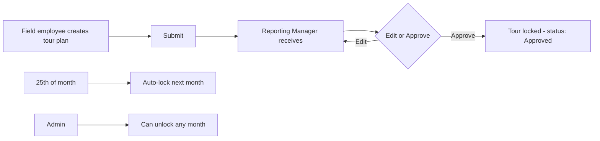
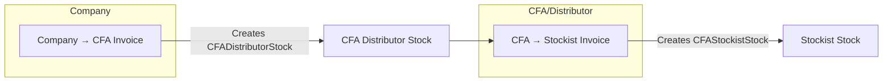
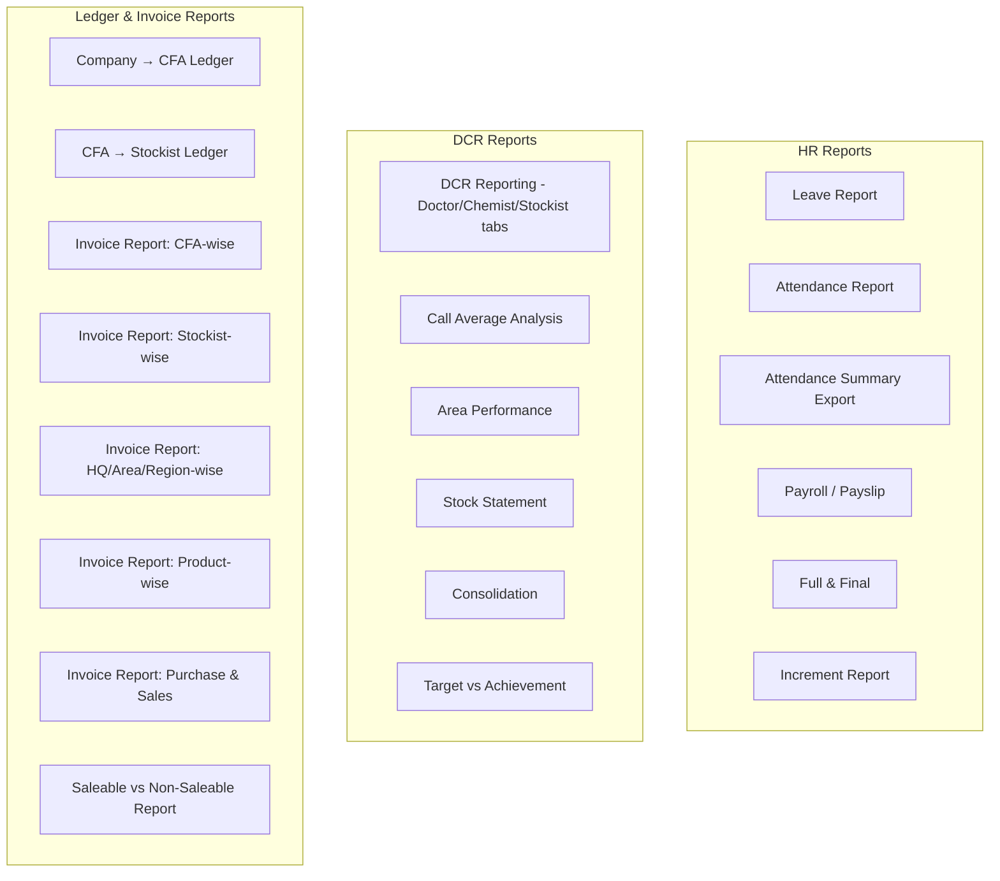

# Pharma CRM – Client Documentation (Detailed)

**Document Version:** 1.0  
**Date:** February 2026  
**Reference:** Software Requirement Specification (clientrequirement.md)

**Flow charts:** Section 3 uses Mermaid format. They render on GitHub, GitLab, and in many Markdown viewers. Paste any chart into [https://mermaid.live](https://mermaid.live) to view or export as image.

---

## Table of Contents

1. [Introduction & System Overview](#1-introduction--system-overview)
2. [User Roles & Access Control](#2-user-roles--access-control)
3. [Flow Charts](#3-flow-charts)
4. [How to Use the System – Detailed](#4-how-to-use-the-system--detailed)
5. [Change Log & Implementation Summary](#5-change-log--implementation-summary)

---

## 1. Introduction & System Overview

### 1.1 Purpose (Ref: clientrequirement §1.1)

This document describes the **Pharma CRM** system delivered against the Software Requirement Specification. The system is an integrated enterprise solution for a pharmaceutical sales organization and covers:

- **HR Management** – Employee lifecycle from onboarding to separation, leave, attendance, payroll, full & final settlement, and increment.
- **Daily Call Reporting (DCR)** – Field force activity via GPS-based daily call reports, tour plans, doctor/chemist/stockist visits, stock statements, and expenses.
- **Invoicing** – Multi-level invoicing (Company → CFA/Distributor → Stockist), batch-wise inventory, ledgers, credit notes, and supplier/purchase linkage.
- **Reporting** – Role-based, hierarchy-driven reports for HR, DCR, and Invoicing with standard fields and export options.

The solution is accessible via **Web** (and Mobile as per SRS scope).

### 1.2 System Overview (Ref: §1.2)

- **Employee lifecycle & payroll:** Onboarding with unique Employee ID (RVB prefix), designation, department, assigned HQ, bank details; leave (CL/EL/SL) with accrual and approval flow; attendance (office clock-in/out, field from DCR close); payroll and payslip (PDF); full & final; increment with effect date.
- **Field force & DCR:** Area structure (Zone → Region → Area → HQ → Ex-Station/Out-Station); doctor/chemist/stockist masters; monthly tour plan (submit → manager approve → lock; auto-lock 25th); daily DCR with work type, station, multiple calls, GPS; stock statement (opening/primary/secondary/closing) and consolidation; expense submit and approval.
- **Invoicing:** Product master; purchase entry with optional supplier invoice match; CFA/Distributor with assigned HQ/Area; Company→CFA and CFA→Stockist invoices (IGST / CGST+SGST); inventory auto-update; multiple payment entries; credit notes (Saleable/Non-Saleable); ledgers and invoice reports.
- **Reports:** All reports display standard fields (Employee Name, Employee ID, Designation, Department, HQ, Date of Joining) where applicable. HR reports (Leave, Attendance, Payroll, F&F, Increment); DCR reports (date/HQ/area/region filters, Call Average, Area Performance, Target vs Achievement); Invoice reports (Ledgers, CFA-wise, Stockist-wise, HQ/Area/Region, Product-wise, Purchase & Sales, Saleable vs Non-Saleable).

---

## 2. User Roles & Access Control

### 2.1 Role Hierarchy (Ref: §2.1)

From bottom to top:

| Level | Role |
|-------|------|
| 1 | Medical Representative (MR) |
| 2 | Area Business Manager (ABM) |
| 3 | Regional Manager (RM) |
| 4 | Zonal Manager (ZM) |
| 5 | Sales Manager |
| 6 | PMT |
| 7 | HR |
| 8 | Admin |

### 2.2 Access Control (Ref: §2.2)

- **Role-based access (RBAC):** Every module and action is controlled by permissions assigned to roles (e.g. view_dcr_reports, add_dcr_reports, view_cfa_distributor_invoices). Users only see menus and data allowed by their role.
- **Hierarchy:** A user in a **higher** role can view and (where permitted) manage data of users in **lower** roles (e.g. ABM sees MRs in their scope). A user in a **lower** role **cannot** see data of users above them.
- **Admin:** Has full control; can manage all masters (Zone, Region, Area, HQ, etc.) and override where applicable.
- **Assigned HQ and area:** For field roles, **Assigned HQ** (and for ABM and above: Area(s), Region(s), Zone(s)) is set at onboarding. This controls:
  - Which doctors, chemists, stockists (DCR masters) they can add/view.
  - Which HQs/stations appear in DCR and tour plan.
  - Scope of DCR and stock statement reports (visibility by HQ/Area/Region/Zone).

---

## 3. Flow Charts

### 3.1 Role Hierarchy & Data Visibility

### 3.2 Leave Approval Flow (Ref: §3.1.2)

### 3.3 DCR Daily Flow (Ref: §3.2.5)

### 3.4 Tour Plan Flow (Ref: §3.2.4)

### 3.5 Invoice Flow – Company to CFA to Stockist (Ref: §3.3.4)

### 3.6 Reporting & Menu Structure

---

## 4. How to Use the System – Detailed

### 4.1 HR Module (Ref: §3.1)

#### 4.1.1 Employee Onboarding (§3.1.1)

**Menu:** **Employees** → **Add Employee** (or **Create**).

**Steps:**

1. Open **Employees** from the main menu, then click **Add Employee** (or equivalent create action).
2. Fill in the employee master data:
   - **Name**
   - **Designation** (from master)
   - **Department** (from master)
   - **Assigned HQ** (from Pharma Headquarter master) – this controls DCR visibility and area access.
   - **Reporting To** (select reporting manager for leave and DCR approval).
   - **Aadhaar Number, PAN Number, UAN Number**
   - **Date of Birth**
   - **Present Address, Permanent Address**
   - **Date of Joining**
   - **Employment Status** (Probation / Confirmed / Resigned)
   - **Bank Name, Bank Account Number, IFSC Code, Branch Name**
   - Any other fields as per the form (e.g. contact, email for login).
3. Save. The system generates a unique **Employee ID** with prefix **RVB**.
4. For **ABM and above**, you can also assign **Area(s)**, **Region(s)**, and **Zone(s)** where applicable (used for DCR and report visibility).

**Note:** Assigned HQ (and areas/regions/zones for higher roles) is used throughout DCR, tour plan, and reporting to restrict what the employee can see and do.

---

#### 4.1.2 Leave Management (§3.1.2)

**Leave types:**

- **Casual Leave (CL):** Accrual 0.8 per month, pro-rata from joining; visible to all but can be taken only after confirmation (as per policy).
- **Earned Leave (EL):** Accrual 1.5 per month, pro-rata from joining; included in Full & Final; visible to all, typically available after confirmation.
- **Sick Leave (SL):** Accrual 1 per month, pro-rata from joining; can be taken as per policy.

**Apply leave:** **Leaves** → **Apply Leave** (or **Add Leave**). Select leave type, date range, reason; submit. Flow: **Employee → Reporting Manager → HR**. Balance is auto-calculated.

**Leave report:** **Reports** → **Leave Report**. Apply filters (date, employee, department, etc.). Report shows standard fields (Employee Name, Employee ID, Designation, Department, HQ, DOJ). **Export to Excel** and **Print** are available.

---

#### 4.1.3 Attendance Management (§3.1.3)

- **Office employees:** **Attendance** – manual or system **clock-in** and **clock-out** (or biometric integration if configured).
- **Field employees:** Attendance is **not** entered manually. It is **auto-marked only when the employee closes the DCR** for that date (Close Day). The attendance date must match the DCR date.
- **Finalise attendance:** Use the option to **finalise monthly attendance** (as provided in the Attendance screen). After finalisation, payroll can be generated for that month.

**Attendance report:** **Reports** → **Attendance Report**. Shows clock-in/clock-out and present/absent. **Export Excel (Present/Absent Summary)** gives: Employee Name, Employee ID, Designation, Department, DOJ, HQ, **Working Days**, **SL**, **CL**, **EL**, **Holiday**, **Paid Days**.

---

#### 4.1.4 Payroll & Payslip (§3.1.4)

**Menu:** **Payroll** (or **Payroll** → **Salary** / **Payslip**).

- Payroll is generated as per the provided format and considers **attendance**, **leave**, **deductions**, **allowances**.
- There is an option to **manually fill salary heads** while adding/editing employee salary.
- **Payslip:** Monthly, **downloadable (PDF)**, **printable**.
- **Exports:** Salary Monthly and Salary Cumulative exports include **DOJ** and **HQ** (and other standard fields).

---

#### 4.1.5 Full & Final Settlement (§3.1.5)

**Menu:** **Employees** → select **resigned/terminated** employee → **Full & Final** (or **F&F** menu).

- Applicable for resigned/terminated employees.
- Calculates **salary payable**, **EL balance**, **deductions**.
- **Generate Full & Final Statement** in the given format (PDF). Statement shows Name, Employee ID, Designation, Department, HQ, DOJ.

---

#### 4.1.6 Increment (§6 in SRS)

**Menu:** **Payroll** (or **Increment** / **Salary** section as per menu).

- **Option to add increment amount with effect date.**
- Salary is generated according to the amount as per the date of increment.
- **Increment report:** **Payroll Reports** → **Salary Report** tab → **Increment Report** download. Export lists increments with standard fields plus **Increment Date** and **Amount**. Filters: date range (month-year), department, designation.

---

### 4.2 DCR Module (Ref: §3.2)

#### 4.2.1 Area Mapping (§3.2.1)

**Structure:** Zone → Region → Area → HQ → Ex-Station / Out-Station.

**Menu:** **Settings** / **Pharma Areas** (or equivalent for area management).

- **Admin:** Can add/edit/delete **Zone**, **Region**, **Area**, **HQ** (masters).
- **ABM and above:** Can add/edit/delete **Ex-Station** and **Out-Station** (for assigned scope where applicable).

Navigation typically has sections for Regions, Areas, Headquarters, Ex-Stations, Out-Stations. Use **Add** / **Edit** / **Delete** as per permissions.

---

#### 4.2.2 Area Visibility (§3.2.2)

- Employees see **only** their **assigned HQ** and the **Ex-Stations** and **Out-Stations** linked to that scope.
- Assignment is done **during onboarding** (Assigned HQ; for ABM and above, Area(s), Region(s), Zone(s)).
- All DCR-related screens (doctors, chemists, stockists, DCR list, tour plan) restrict data to this visible scope.

---

#### 4.2.3 Doctor / Chemist / Stockist Master (§3.2.3)

**Menus:** **Doctors**, **Chemists**, **Stockists**.

- **Medical Representative and above** can **add** Doctor, Chemist, Stockist **in assigned areas only**.
- **Area Manager and above** can **edit / delete** (within scope).
- **Features:**
  - **HQ / Ex-Station / Out-Station** wise filters on the list page.
  - **Bulk import** via **Excel** (import scoped to allowed HQs).
- **Visibility:** Field staff see only records in their assigned area/HQ.

**Steps to add:** Open Doctors (or Chemists/Stockists) → **Add** → fill name, contact, HQ, station, area, etc. → Save.

---

#### 4.2.4 Tour Plan (§3.2.4)

**Menu:** **DCR** → **Tour Plan** (or **Submit DCR** / Tour section).

**Workflow:**

1. **Field employee** creates the **monthly tour plan** and **submits**.
2. Plan is **auto-sent to Reporting Manager** (notification).
3. **Reporting Manager** can **fully edit** the plan **before approval**.
4. Manager **approves** → tour plan becomes **locked** and is shown on the employee dashboard as **Approved**. Only Admin can edit after that.
5. **Rules:**
   - **Auto-lock on 25th** of every month for **next month** (no new plan creation for next month by non-admin after 25th).
   - **Admin can unlock** any time from the tour plan / lock management screen.

---

#### 4.2.5 Daily Call Reporting – DCR Entry (§3.2.5)

**Menu:** **DCR** → **Submit DCR** (or **Create DCR**).

**Steps:**

1. **Day Start:** Open the DCR create screen.
   - **Reporting date** defaults to **last unreported date** (or first pending date from approved tour).
   - **Assigned HQ** is **auto-filled**.
2. Select:
   - **Work Type** (from master, e.g. Working Day, Field Work, Leave, etc.).
   - **Worked Station** (HQ / Ex-Station / Out-Station).
   - **Worked With** (hierarchy-based: select another employee if applicable).
3. **If Work Type = Working Day (or Field Work):**
   - Add **multiple Doctor / Chemist / Stockist calls**.
   - Each call can have **GPS geo-tagging** (mandatory if enforced). Call is allowed only if the employee is within the configured distance (e.g. 100 meters).
   - Fill product/sample/POB/remarks as per form.
4. **Other work types:** Only **Remarks** are required (no call entries).
5. **Close Day:** Click **Close Day** (or equivalent). The system:
   - Saves the DCR and **submits** it (to Reporting Manager for approval if applicable).
   - **Marks attendance** for that date for the employee.

**View / Approve DCR:** **DCR** → **DCR Reporting** (to view list) or **Approve DCR Reports** (to approve). Filters: **Date**, **HQ**, **Area**, **Region** (and employee if permission allows). Tabs: **Doctor Visits**, **Chemist Visits**, **Stockist Visits**.

---

#### 4.2.6 DCR Visibility (§3.2.6)

- **Representative** sees **own DCR** only.
- **Upper hierarchy** sees **lower hierarchy** DCR (based on role and reporting structure).
- Visibility is further filtered by **HQ**, **Area**, **Region**, **Zone** (from assigned scope). Only DCRs within the viewer’s accessible scope are listed and can be approved/rejected.

---

#### 4.2.7 Sales Plan (§3.2.7)

**Menu:** **DCR** → **Sales Plan** (or as per menu).

- **Entry level:** HQ-wise, Area-wise, Region-wise (select level and then the specific HQ/Area/Region).
- **Visible only to upper hierarchy** (e.g. hierarchy level ≥ 2 or Admin). **Not visible to MR** (level 1).

---

#### 4.2.8 Stock Statement (§3.2.8)

**Menu:** **DCR** → **Stock Statement** (or **Sales Stock Statement**).

**Logic:**

- **Opening Qty** → from **last month’s closing**.
- **Primary Qty** → **auto from CFA to Stockist invoice** (system pulls from invoice data for the period).
- **Secondary Qty** → **entered by MR**.
- **Closing Qty** → **auto-calculated** (Opening + Primary + Secondary).

**Steps:** Select period and stockist → create/edit statement → enter secondary where needed → **Submit**. Statements can be saved as **Draft** (editable) or **Submitted** (used in consolidation). **Consolidation:** **DCR** → **Stock Statement Consolidation** – view roll-up HQ → Area → Region → Zone. **Target vs Achievement:** **DCR** → **Target vs Achievement** – Primary = invoicing, Secondary = stock statement; select period and level (HQ/Area/Region).

**Visibility:** Submitted by MR; visible to all upper hierarchy within scope.

---

#### 4.2.9 DCR Reports – Detailed

| Report | Menu path | What it does | Filters |
|--------|-----------|--------------|---------|
| **DCR Reporting** | **DCR** → **DCR Reporting** | List of doctor/chemist/stockist visits in tabbed view | Date range, HQ, **Area**, **Region**, Employee (if permission) |
| **Call Average Analysis** | **DCR** → **Call Average Analysis** | Average doctor/chemist/stockist calls per working day per employee | Date range, HQ, Area, Region, Employee |
| **Area Performance** | **DCR** → **Area Performance** | Report count, visit counts, distinct doctors/chemists/stockists, total POB by area | Date range, HQ |
| **Target vs Achievement** | **DCR** → **Target vs Achievement** | Primary (invoicing) and Secondary (stock statement) achievement vs target | Period month/year, Level (HQ/Area/Region), HQ/Area/Region filters |

---

#### 4.2.10 Expense Management (§3.2.9)

**Menu:** **Expenses** (Pharma format – day-wise rows, HQ, transport, allowances, vouchers).

- **Field employee** submits expense.
- **Workflow:** Employee → **Reporting Manager** → Approval (or Reject with reason).
- **After approval:** Status shown as **Approved**; can be **linked with payroll** (Include Expense Claims / claimable expenses).
- **Approve screen:** **Expenses** → **Approve Expenses** (for managers to approve or reject).

---

### 4.3 Invoicing Module (Ref: §3.3)

#### 4.3.1 Product Master (§3.3.1)

**Menu:** **Products** → **Add Product** (or Create).

**Fields:** Product Name, **MRP**, **PTS**, **PTR**, **Tax**, **Discount** (and discount type: flat/percentage), **Status** (Active/Inactive). Save.

---

#### 4.3.2 Purchase Entry (§3.3.2)

**Menu:** **Purchase** module → Purchase Entry (or equivalent).

**Capture:** Batch No, Expiry Month & Year, MRP, PTS, PTR, Tax, Discount. Optionally link to **Supplier Invoice** (invoice number, vendor, date, supplier invoice total). System can show match status (matched/unmatched) after save. **Stock update:** Batch-wise inventory is updated.

**Supplier Invoices:** From the Supplier Invoices list or detail page, use **Add purchase entries for this invoice** to open Purchase Entry create with prefilled invoice details.

---

#### 4.3.3 CFA / Distributor Management (§3.3.3)

**Menu:** **Clients** (or **CFA** / **Distributor** section).

- **Create CFA/Distributor** as a **Client** with **User ID (email)** and **Password** (for login).
- Assign **Assigned HQ** and **Area Allotment** (multi-select). These control which stockists the CFA can invoice.
- **CFA can invoice only stockists** whose HQ/Area is in their assignment. When linking stockists to a CFA (CFA Stockist master), the system validates that the CFA has that stockist’s HQ/Area assigned.

**CFA Stockist master:** **CFA Stockists** (or similar). Add/edit stockist; select **Headquarter** and **Area**. Link stockist to one or more CFAs; only CFAs with matching HQ/Area can be linked.

---

#### 4.3.4 Invoicing (§3.3.4)

**Invoice types:** **IGST** (Inter-State) and **CGST + SGST** (Intra-State). Selected at invoice level; templates and calculations follow the type.

**Company → CFA/Distributor invoice:** **Ledger** / **Invoices** → **CFA Distributor Invoices** (or **Company → CFA**). Create invoice → select **CFA (client)** → add items (products, quantity, rate, **discount**, **scheme** e.g. 20+2) → multiple **payment entries** (Amount, Date, Cheque/Reference, Remarks) → Save. **Inventory:** CFADistributorStock is auto-created/updated.

**CFA → Stockist invoice:** **CFA Stockist Invoices**. Select **stockist** (list is filtered by logged-in CFA’s assigned HQ/Area). Add items from **CFA distributor stock**; add **discount/scheme** per line. Multiple **payment entries** as above. Save → CFAStockistStock is updated.

**Credit note:** From **invoice show** page use **Add Credit Note** (Company→CFA); or from **Credit Notes** module create credit note and select invoice (works for both Company→CFA and CFA→Stockist). **Apply credit to invoices** from Credit Notes module (apply to invoice).

---

#### 4.3.5 Stockist for Invoicing (§3.3.5)

- **Invoice-purpose stockists** are **CFA Stockists** (separate from DCR doctor/chemist/stockist masters).
- Mapped to **HQ** and **Area** (and Region/Zone via area hierarchy). Used for CFA→Stockist invoicing and ledger/reports.

---

#### 4.3.6 Credit Notes (§3.3.6)

**Menu:** **Credit Notes** (and from invoice show).

- Applicable at **Company → CFA** and **CFA → Stockist**.
- **Types:** **Saleable** and **Non-Saleable** (select at create/edit).
- **Unique credit note number** (like invoice) – system generates using prefix and digit setting.

---

#### 4.3.7 Ledgers (§3.3.7)

**Company → CFA Ledger:** **Ledger** → **Company CFA Ledger**. Select **date range** and **party (CFA)**. View rows: invoices (debit), payments (credit), credit notes (credit), with **running balance** and **opening balance** for the range.

**CFA → Stockist Ledger:** **Ledger** → **CFA Stockist Ledger**. Select **date range** and **party (Stockist)**. Same row types and balance.

---

#### 4.3.8 Invoice Reports – Detailed

| Report | Menu path | What it shows | Filters |
|--------|-----------|----------------|--------|
| **Company → CFA Ledger** | **Ledger** → **Company CFA Ledger** | Transaction list and balance per CFA | Date range, Party (CFA) |
| **CFA → Stockist Ledger** | **Ledger** → **CFA Stockist Ledger** | Transaction list and balance per stockist | Date range, Party (Stockist) |
| **Invoice Report: CFA-wise** | **Ledger** → **Invoice Report: CFA-wise** | Invoice count and total amount per CFA | From date, To date |
| **Invoice Report: Stockist-wise** | **Ledger** → **Invoice Report: Stockist-wise** | Invoice count and total amount per stockist | From date, To date |
| **Invoice Report: HQ/Area/Region-wise** | **Ledger** → **Invoice Report: HQ/Area/Region-wise** | Invoice count and total grouped by HQ, Area, or Region | From date, To date, **Group by** (HQ / Area / Region) |
| **Invoice Report: Product-wise** | **Ledger** → **Invoice Report: Product-wise** | Total quantity, value, invoice count per product | From date, To date, **Invoice type** (Company→CFA / CFA→Stockist) |
| **Invoice Report: Purchase & Sales** | **Ledger** → **Invoice Report: Purchase & Sales** | Purchase summary (orders) + Sales summary (Company→CFA + CFA→Stockist) for date range | From date, To date |
| **Saleable vs Non-Saleable** | **Credit Notes** → **Saleable vs Non-Saleable Report** | Credit notes by type (Saleable / Non-Saleable) | As per screen filters |

---

### 4.4 Reporting – Complete Menu Reference (§3.4)

**Common fields** (where applicable): Employee Name, Employee ID, Designation, Department, HQ, Date of Joining.

| Report | Menu path |
|--------|-----------|
| Leave Report | **Reports** → **Leave Report** |
| Attendance Report | **Reports** → **Attendance Report** |
| Attendance Summary (Present/Absent, Working Days, SL, CL, EL, Holiday, Paid Days) | **Reports** → **Attendance Report** → **Export Excel (Present/Absent Summary)** |
| Payroll / Payslip | **Payroll** → Salary / Payslip |
| Full & Final | **Employees** → F&F or **Full & Final** |
| Increment Report | **Payroll Reports** → **Salary Report** tab → **Increment Report** download |
| DCR Reporting (Doctor/Chemist/Stockist) | **DCR** → **DCR Reporting** |
| Call Average Analysis | **DCR** → **Call Average Analysis** |
| Area Performance | **DCR** → **Area Performance** |
| Stock Statement | **DCR** → **Stock Statement** |
| Stock Statement Consolidation | **DCR** → **Stock Statement Consolidation** |
| Target vs Achievement | **DCR** → **Target vs Achievement** |
| Company → CFA Ledger | **Ledger** → **Company CFA Ledger** |
| CFA → Stockist Ledger | **Ledger** → **CFA Stockist Ledger** |
| Invoice Report: CFA-wise | **Ledger** → **Invoice Report: CFA-wise** |
| Invoice Report: Stockist-wise | **Ledger** → **Invoice Report: Stockist-wise** |
| Invoice Report: HQ/Area/Region-wise | **Ledger** → **Invoice Report: HQ/Area/Region-wise** |
| Invoice Report: Product-wise | **Ledger** → **Invoice Report: Product-wise** |
| Invoice Report: Purchase & Sales | **Ledger** → **Invoice Report: Purchase & Sales** |
| Saleable vs Non-Saleable Report | **Credit Notes** → **Saleable vs Non-Saleable Report** |

---

## 5. Change Log & Implementation Summary

This section maps each section of **clientrequirement.md** to implementation status and notes.

### 5.1 §1 Introduction – Implemented

- Purpose and scope as per SRS; Web access; HR, DCR, Invoicing, Reporting delivered as specified.

### 5.2 §2 User Roles & Hierarchy – Implemented

- All eight roles; RBAC; hierarchy visibility; Admin full control; Assigned HQ and area/region/zone for field staff.

### 5.3 §3.1 HR Module – Implemented

| §Ref | Requirement | Status | Implementation notes |
|------|-------------|--------|------------------------|
| 3.1.1 | Employee onboarding (RVB ID, HQ, bank, etc.) | Done | Employee ID prefix RVB; Assigned HQ; Area(s)/Region(s)/Zone(s) for ABM+; controls DCR and reporting scope. |
| 3.1.2 | Leave (CL/EL/SL, accrual, approval flow, report, Excel, print) | Done | 0.8 CL, 1.5 EL, 1 SL per month; pro-rata; Employee→Manager→HR; Leave Report with export and print. |
| 3.1.3 | Attendance (office/field, finalise, payroll link) | Done | Field = from DCR close only; finalise month; Attendance Report + Present/Absent Summary export (Working Days, SL, CL, EL, Holiday, Paid Days). |
| 3.1.4 | Payroll & Payslip (format, manual heads, PDF, attendance/leave/deductions/allowances) | Done | Exports include DOJ, HQ; PDF payslip. |
| 3.1.5 | Full & Final (salary, EL, deductions, statement format) | Done | PDF with standard fields. |
| §6 | Increment (amount + effect date; salary as per date) | Done | Increment Report export with common fields + Increment Date, Amount; filters. |
| 3.4 | Common report fields (Emp code, Name, DOJ, Dept, Designation, HQ) | Done | All HR reports and exports. |

### 5.4 §3.2 DCR Module – Implemented

| §Ref | Requirement | Status | Implementation notes |
|------|-------------|--------|------------------------|
| 3.2.1 | Area mapping (Zone→Region→Area→HQ→Ex/Out-Station; ABM+ for Ex/Out; admin for rest) | Done | PharmaAreaController; isABMOrAbove for Ex/Out-Station. |
| 3.2.2 | Area visibility (assigned HQ only; onboarding) | Done | AccessibleHeadquarters trait; employee_details headquarter_id, areas, regions, zones. |
| 3.2.3 | Doctor/Chemist/Stockist (add/edit/delete, filters, Excel import) | Done | Scope by HQ/Ex/Out; import scoped. |
| 3.2.4 | Tour plan (submit→Manager→approve→lock; 25th auto-lock; Admin unlock) | Done | TourController; tour_month_locks; unlockMonth for admin. |
| 3.2.5 | DCR (date, HQ, work type, station, calls, GPS, Close Day→attendance) | Done | Default date from tour; GPS configurable (e.g. 100m); field_work_types config. |
| 3.2.6 | DCR visibility (own/upper hierarchy; HQ/Area/Region/Zone) | Done | RoleHierarchy + AccessibleHeadquarters; filters on index. |
| 3.2.7 | Sales plan (HQ/Area/Region; upper hierarchy only) | Done | Hierarchy level ≥ 2 or admin. |
| 3.2.8 | Stock statement (opening/primary/secondary/closing; consolidation; Target vs Achievement) | Done | Primary from invoice; consolidation HQ→Area→Region→Zone; Target vs Achievement Primary=invoicing, Secondary=stock statement. |
| 3.2.9 | Expense (submit→Manager approve; status; payroll link) | Done | Approve/Reject on Approve Expenses. |
| 3.4 | DCR reports: Date/HQ/Area/Region filters, Call average, Area performance, Target vs Achievement | Done | All four; Call Average Analysis and Area Performance as new pages. |

### 5.5 §3.3 Invoicing Module – Implemented

| §Ref | Requirement | Status | Implementation notes |
|------|-------------|--------|------------------------|
| 3.3.1 | Product (name, MRP, PTS, PTR, tax, discount, status) | Done | ProductController; all fields. |
| 3.3.2 | Purchase entry (batch, expiry, match supplier invoice; batch stock) | Done | Optional supplier invoice total; match status; link from Supplier Invoices. |
| 3.3.3 | CFA (User ID/password, HQ/Area; only assigned stockists) | Done | Client with client_areas, client_headquarters; validation on link and invoice. |
| 3.3.4 | Invoicing (IGST/CGST+SGST; Company→CFA, CFA→Stockist; inventory; payments; credit note; discount/scheme) | Done | Templates; CFADistributorStock/CFAStockistStock; payment modal; credit note from invoice or module; scheme/discount on lines. |
| 3.3.5 | Stockist (invoice purpose; HQ/Area/Region/Zone) | Done | CFAStockist; headquarter_id, area_id; Region/Zone via area. |
| 3.3.6 | Credit notes (both levels; Saleable/Non-Saleable; unique number) | Done | credit_note_type; cn_number with prefix/digit. |
| 3.3.7 | Ledgers (Company→CFA, CFA→Stockist; date & party) | Done | LedgerController; both ledgers with filters. |
| 3.4 | Invoice reports: CFA-wise, Stockist-wise, HQ/Area/Region, Product-wise, Purchase & Sales; Saleable vs Non-Saleable | Done | InvoiceReportController; all under Ledger menu. |

### 5.6 §3.4 Reporting Module – Implemented

- Common fields on all applicable reports.
- HR: Leave, Attendance, Attendance Summary export, Payroll, F&F, Increment – all with standard fields and export/print where specified.
- DCR: DCR Reporting (with Date/HQ/Area/Region), Call Average Analysis, Area Performance, Target vs Achievement.
- Invoice: Ledgers + CFA-wise, Stockist-wise, HQ/Area/Region-wise, Product-wise, Purchase & Sales + Saleable vs Non-Saleable.

### 5.7 Technical / Deployment

- **Supplier Invoices migration:** Index name on `supplier_invoices` shortened to meet MySQL 64-character limit (`sup_inv_cid_vid_invno_date_idx`).
- **Hostinger:** Cache path fix – ensure `storage/framework/cache/data`, `storage/framework/sessions`, `storage/framework/views`, `storage/logs`, `bootstrap/cache` exist and are writable (chmod 775).

---

**End of detailed client documentation.** For any further clarification or training on a specific screen, refer to the application and this document together with clientrequirement.md.
